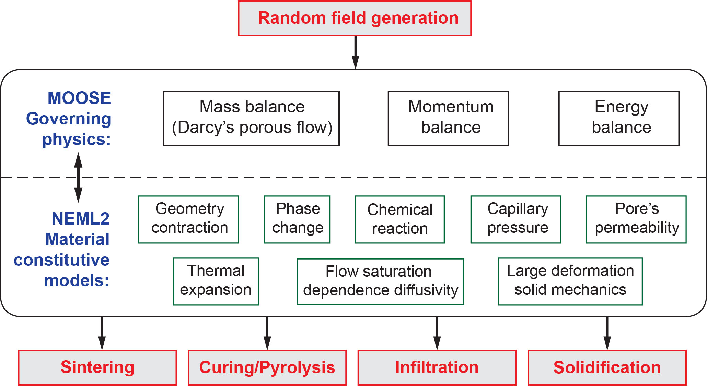

# PUMA: Powder Utilization Modeling Application

PUMA is a high performance modeling framework to simulate powder processing. It provides a scalable tool for manufacturers to simulate powder pre- and post-processing.

The tool can predict distortion, residual stress, and (for reactive processes) reaction completion fraction of complex parts after curing/debinding, sintering, and infiltration processes. These predictions are key metrics industry uses to optimize these processes to produce dense, defect-free, stable components.


https://youtu.be/I8haQ0K7SB0


## Architecture
PUMA is structured into two major levels: the governing physics and the material constitutive descriptions with an initial condition generated via a random field.



The governing physics are represented by four primary partial differential equations: conservation of mass through Darcy flow in porous media with an $L^2$-projection for pore pressure, conservation of energy, and balance of linear momentum. These equations are implemented within the MOOSE framework , which provides finite element utilities for solving the governing equations in a fully coupled manner.

The material constitutive response is handled through the NEML2 constitutive modeling library, designed for complex material behavior and efficient scaling on hybrid computing architectures. The integration of MOOSE and NEML2 in PUMA supports simulation of various powder-based post-processing techniques, including sintering, curing, pyrolysis, infiltration, and solidification.

## Chaining of sub-modules
Each submodule solves a different set of equations, but the unknowns and state variables are kept consistent, e.g., displacements, temperature, volume fractions, and pore pressure, from which derived constitutive quantities (e.g., stress, composition, capillary pressure, permeability) are computed.

Displacement and temperature fields, along with their derived quantities, are transferred directly between submodules and serve as initial conditions for subsequent steps. Derived constitutive quantities are likewise transferred through the state variables. For example, in the transition from curing to pyrolysis, the cured phenolic resin becomes the binder phase in the pyrolysis model.

The transfer of fluid volume fraction depends on the process sequence. In the case of reactive infiltration followed by solidification, the infiltrating liquid phase (e.g., Si) is directly transferred as the fluid variable; subsequent reaction and solidification models convert this fluid into either product (e.g., SiC) or solidified liquid phases.

Refer to `examples` folder for usage demonstrations and sample input.

## Installation Instructions

For the random field generation from images:
https://github.com/skounouho/puma-cobra.git

1. __Required python packages__

- check `environment.ymal` for full list of required Python packages with conda environment. This environment will be named `graintrace_env`. To create the same environment with conda, run:

```bash
conda env create -f environment.yml
```

2. __MOOSE with NEML2__

The required libraries can be obtained form the github packages below, however, it is recommended to follow the instructions below or the official websites to make sure the dependencies are satisfied:

- MOOSE: `https://github.com/idaholab/moose.git` with branch: `master`
- NEML2: `git@github.com:applied-material-modeling/neml2.git` with branch: `main`

Here are the resources to successfully compile MOOSE with NEML2

- Built MOOSE from source: `https://mooseframework.inl.gov/getting_started/installation/hpc_install_moose.html`

- Built NEML2 from source: `https://applied-material-modeling.github.io/neml2/install.html` and `https://applied-material-modeling.github.io/neml2/tutorials-getting-started.html`

- Linking MOOSE and NEML2: `https://mooseframework.inl.gov/getting_started/installation/install_neml2.html` and `https://mooseframework.inl.gov/getting_started/installation/install_libtorch.html`

__Instructions__: at least worked for `Ubuntu 20.04` with the appropriate `mpi` and compiler packages. Check the above websites for prerequisites and dependencies.

- Here we assume the current path is in an empty folder. This folder will contain all of the MOOSE related programs. Also there is a current conda environment activated with the necessary dependencies.

```bash
mkdir projects
cd projects
```

- Build MOOSE: make sure the gcc / compilers are located in the correct path, usually it is `/usr/bin/mpicc`.

```bash
export CC=mpicc CXX=mpicxx FC=mpif90 F90=mpif90 F77=mpif77
git clone https://github.com/idaholab/moose.git
export MOOSE_DIR=${PWD}/moose
cd moose
git checkout master
export MOOSE_JOBS=12 METHODS=opt
cd scripts
./update_and_rebuild_petsc.sh
./update_and_rebuild_libmesh.sh
./update_and_rebuild_wasp.sh
cd ../../
```

- Obtain GPU-enable based libtorch (this is for CUDA 12.6 - find compatibility matrix at: `https://github.com/pytorch/pytorch/blob/main/RELEASE.md#release-compatibility-matrix`). If other versions are required, change the argument for the wget command from `https://pytorch.org/get-started/locally/`. Make sure to select `Stable` `Linux` `LibTorch`. Copy and paste the link in `Run this Command:`. Make sure to do this outside of moose and inside the `projects` folder.

```bash
wget https://download.pytorch.org/libtorch/cu126/libtorch-shared-with-deps-2.10.0%2Bcu126.zip
unzip libtorch-shared-with-deps-2.10.0+cu126.zip
export LIBTORCH_DIR=${PWD}/libtorch
```

- Obtain the compatible NEML2 and compile NEML2 for MOOSE and python package.

```bash
cd moose
./configure --with-libtorch --with-neml2
./scripts/update_and_rebuild_neml2.sh
```

Once neml2 is compiled, some message like this will appear, run the `cd <messagaes>`.

```bash
****************************************************************************************************
NEML2 has been successfully installed.
To configure MOOSE with NEML2, run the following commands:
  cd <messages>
****************************************************************************************************
```

Look at the last line, if it said `config.status: framework/include/base/MooseConfig.h is unchanged`. Then the NEML2-LIBTORCH configurations point to the correct path.

- Compile PUMA with linked MOOSE-NEML2.

```bash
cd ../
git clone git@github.com:applied-material-modeling/puma.git
cd puma
git checkout origin/development
make -j 12
```

- Compile NEML2 custom materials in PUMA

```bash
cd neml2_models
cmake \
  -Dneml2_ROOT=${PWD}/moose/framework/contrib/neml2/installed/moose \
  -DPUMA_MATLIB_TESTS=off -DCatch2_DIR=${PWD}/moose/framework/contrib/neml2/contrib/Catch2/lib/cmake/Catch2 \
  -Dwasp_ROOT=/home/tranh/projects/aps_build/neml2/contrib/wasp -DCMAKE_BUILD_TYPE=Release -B build/release -S .
cmake --build build/release -j 16
```

- Make sure the conda environment from `environment.ymal` is active. Then do:

```bash
conda activate graintrace_env
./run_tests
```

If all tests passed, then it is successfully compiled.