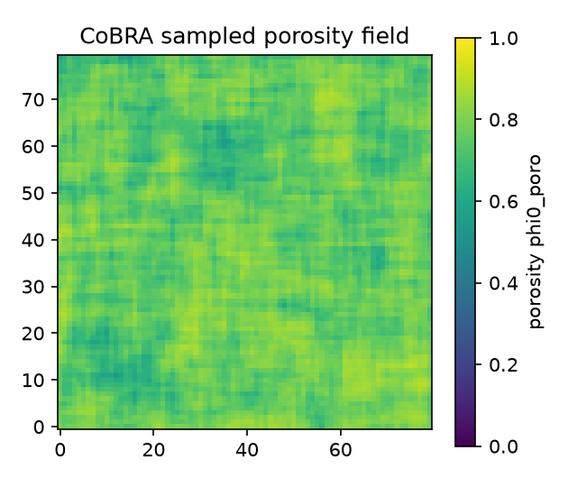

# Random porosity field from a CT scan (CoBRA)

This example generates a spatially-correlated **porosity** field from a real
micro-CT scan and converts it into a PUMA initial-condition CSV. It is a
**generation-only** example — it does not run a simulation. The produced
`initial_condition.csv` is meant to be fed to any PUMA input that reads a
porosity field (see [Feeding it into PUMA](#feeding-it-into-puma)).

It uses [CoBRA](https://github.com/skounouho/puma-cobra) (*CT-Based Random-field
Approximation*), which fits a covariance kernel to CT imagery and draws new
realizations of the field with a Karhunen–Loève expansion.

```
CT scan (TIFF stack)
   └─ prepare_ct_scan.py ─► data/scans.npy      (N top slices = N samples of a 2D porosity field)
        └─ cobra config.yml ─► output/beta/sample_{}.e   (KL pipeline: 5 stages)
             └─ cobra_to_puma_csv.py ─► initial_condition.csv   (x, y, z, phi0_poro)
                  └─ (feeds a PUMA input via PropertyReadFile)
```



## Requirements

Use the environment PUMA is built with (here: `moose-src`), then install CoBRA
(pip only — CoBRA is **not** vendored as a submodule):

```bash
pip install git+https://github.com/skounouho/puma-cobra.git
```

This pulls CoBRA's dependencies, including the `exodusii` fork it uses to read
and write the `.e` field files. `numpy`, `scipy`, `scikit-learn`, `meshio`,
`pyyaml`, and `Pillow` are already present in the PUMA environment.

## Run it

```bash
python generate.py            # prepare CT -> cobra -> CSV, plus a preview PNG
```

Common variants:

```bash
python generate.py --no-prepare        # reuse the committed data/scans.npy (no CT access needed)
python generate.py --domain 0.1        # rescale the CSV x,y to a [0, 0.1] square (match your FE mesh)
```

You can also drive each step yourself — this is CoBRA's native workflow:

```bash
python prepare_ct_scan.py              # CT TIFF stack -> data/scans.npy
cobra config.yml                       # run all 5 stages (or e.g. `cobra config.yml --sample`)
python cobra_to_puma_csv.py            # output/beta/sample_0.e -> initial_condition.csv
```

## The CT scan

The scan itself is large (tens of GB) and is **not** committed. `prepare_ct_scan.py`
reads a TIFF stack (default: the SiC-bar micro-CT at 12 µm/voxel) and, for a band
of slices near the **top surface** where the porosity is statistically stationary
("good covariance"), it:

1. crops an axis-aligned window inside the bar cross-section,
2. binarizes into a pore map (grayscale below a threshold = pore),
3. block-mean downsamples ("cut") into a continuous porosity field in `[0, 1]`.

Point it at a different scan with `CT_DIR=/path/to/tiff_stack python prepare_ct_scan.py`,
and tune the slice band / window / threshold / downsample factor at the top of the
script. The small result — `data/scans.npy`, shape `(rows, cols, N_slices)` — is
committed so the example is reproducible **without** the raw scan (use `--no-prepare`).

> CoBRA reads `data/scans.npy` as `N` samples of a single 2D field (last axis =
> sample axis), so choose a band of slices that are statistically similar.

## What to tune (`config.yml`)

`config.yml` is CoBRA's native config, with every stage exposed:

- `preprocess.scans.physical_resolution` — must match the field in `data/scans.npy`
  (native voxel size × the downsample `BLOCK`; `prepare_ct_scan.py` prints the value).
- `preprocess.smooth.window_size` — moving-average window (metres).
- `preprocess.transform` — the marginal distribution fit to the field (`scipy.stats.beta`).
- `kernel_fit.kernel` — one covariance kernel per axis (`Exponential` here).
- `factorize.intervals` — the **output grid**: `[start, stop, num]` per axis, in metres,
  over the physical extent of the field. Increasing `num` gives a finer CSV.
- `sample.num_samples`, `sample.random_seed` — number of realizations and reproducibility.

## Feeding it into PUMA

`initial_condition.csv` is a headerless 4-column file `x, y, z, phi0_poro` — exactly
the format PUMA's image-based examples consume via `PropertyReadFile`
(`read_type = 'voronoi'`) + `PiecewiseConstantFromCSV`. Because the reader uses
nearest-neighbour (Voronoi) lookup, the CoBRA grid points need not coincide with the
FE mesh nodes — only the coordinate frame must match (use `--domain` to rescale).

To use it, e.g. with `examples/pip_and_lsi/2D_grid`:

1. Generate the CSV with coordinates matching that mesh's extent (`--domain <L>`), and
   copy `initial_condition.csv` into the target example directory.
2. That example already reads it through `initial_condition_from_csv.i`
   (`nprop = 4`, `column_number = 3`); set `num_file_data` / `nvoronoi` to the CSV row
   count (`cobra_to_puma_csv.py` prints it — 6400 for the defaults here).
3. Run that example's driver as usual.

## Files

| File | Role |
|------|------|
| `prepare_ct_scan.py` | CT TIFF stack → `data/scans.npy` (porosity field) |
| `config.yml` | CoBRA pipeline configuration (all 5 stages) |
| `cobra_to_puma_csv.py` | CoBRA sample `.e` → `initial_condition.csv` (4-column) |
| `generate.py` | Orchestrates the three steps + a preview PNG |
| `data/scans.npy` | Committed CT-derived field (so the example runs without the raw scan) |
